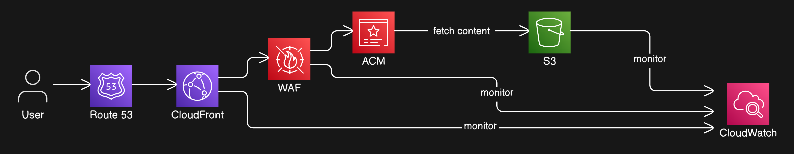

<h1 align="center">
  <strong>MindfulCloud</strong>
</h1>

---

## What problem it solves?

Everyone can host a basic website on AWS that's old news what actually something `secure`,`fast` and `smart` with resource I have. You can't just dump an HTML file somewhere, becuase there are hacker that can come form anywhere, users who'll just bounce if your site takes more than a second load and budgets which needs to be managed that the real problem we're solving here.

## How I build it?

**The AWS resources in that I'll deep dive:**
1. `AWS S3`: That's the foundation for our starage.
2. `CloudFront`: We're going to plug in cloudfront to blast the content worldwide very fast.
3. `Certificate Manager`: Security wise AWS certificate manager will handle **https**.
4. `WAF`: We're throwing **WAF(Web Application Firewall)**
5. `CloudWatch`: Cloudwatch keeps an eye on everthing with custom dashboards and alerts.
6. `AWS Route 53`: For custom domain.

## The Business Impact It Will Create!!!

1. **Speed & Performance** – CloudFront ensures fast content delivery with low latency.
2. **Security** – AWS Certificate Manager enables HTTPS, and WAF protects against attacks.
3. **Cost Efficiency** – Pay-as-you-go pricing with CloudFront reducing bandwidth costs.
4. **Scalability & Reliability** – AWS auto-scales based on demand with high availability.
5. **Monitoring** – CloudWatch provides `real-time` insights with alerts and logs.

---

## The whole picture in one frame!

### AWS Architecture for Hosting a Static Website

This architecture is designed to **host a secure, scalable, and high-performance static website** using AWS services. Let me walk you through it:

## **1️⃣ User Request (Entry Point)**

🔹 A **user** initiates a request by visiting [URL Soon...](www.example.com).  
🔹 The request is sent to **Amazon Route 53**, which is the **DNS service** responsible for resolving domain names into IP addresses.

## **2️⃣ Route 53 → CloudFront**

🔹 Route 53 forwards the request to **Amazon CloudFront** (a CDN service).  
🔹 CloudFront serves cached content if available, reducing latency.

## **3️⃣ Security Layer**

🔹 **AWS WAF (Web Application Firewall)** protects against threats like:

- SQL Injection
- Cross-site Scripting (XSS)
- DDoS attacks  
  🔹 **AWS ACM (AWS Certificate Manager)** provides **SSL/TLS encryption** for secure HTTPS communication.

## **4️⃣ Fetching Content from S3**

🔹 If the content **is not cached** in CloudFront, it fetches the latest version from **Amazon S3** (which stores the static website files like HTML, CSS, JavaScript, and images).  
🔹 S3 acts as the **origin server** for CloudFront.

## **5️⃣ Monitoring & Logging**

🔹 **AWS CloudWatch** monitors:

- **CloudFront:** Request logs, cache hit ratio, performance metrics
- **S3:** Storage access patterns, request metrics  
  🔹 This helps track website **performance, security incidents, and errors.**

## **Key Benefits of This Architecture**

✅ **Low Latency:** CloudFront caches content globally, reducing load times.  
✅ **High Availability:** S3 ensures **durability (99.999999999%)** and **scalability.**  
✅ **Security:** WAF blocks threats, and ACM ensures **HTTPS encryption.**  
✅ **Cost Efficiency:** Pay only for what you use (CloudFront reduces S3 requests).  
✅ **Real-time Monitoring:** CloudWatch provides insights into performance and security.

## Licence

## Give the repo star 🤩
